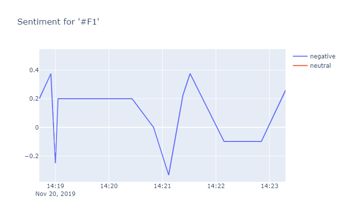

# Twitter-Sentiment-Analysis
1. Python 2.7 or higher
2. clone the repo https://github.com/SCK22/Twitter-Sentiment (use the master branch)
3. Install packages run pip install -r requirements.txt
4. Twitter API authentication Keys, generated from twitter API and put them in a access_tokens.json file in the following format.
```
{
    "api_key" : "XXXXXX",
    "api_secret" : "XXXXXX,
    "access_token" : "XXXXXX,
    "access_token_secret" : "XXXXXX"
} 
```
Analyzing the sentiment of tweets for a particular key word. This analysis is based on the tweet text only.

run python main.py <KEYWORD> <NUM_TWEETS>
example :
```
python main.py audi 1000
```


